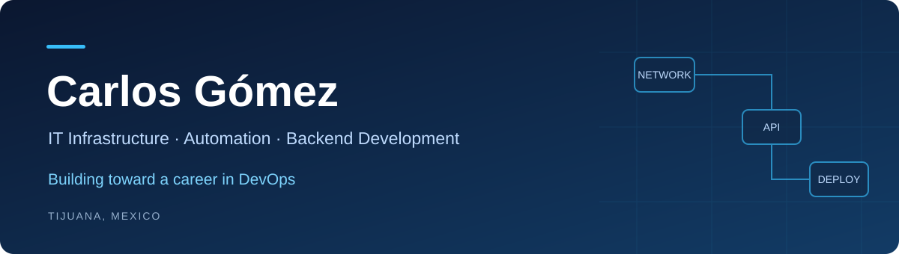

  

  <a href="https://www.linkedin.com/in/carlosgomezc7/">LinkedIn</a> ·
  <a href="https://github.com/carlosgomezc7?tab=repositories">Explore my repositories</a>

## About Me

I'm Carlos Gómez, an IT professional based in Tijuana, Mexico, with hands-on experience in network administration, Windows Server environments, storage systems, and technical support.

My background includes deploying IT infrastructure, managing backup solutions, and coordinating preventive maintenance for more than 200 workstations. I have also coordinated technical support and helped users adopt business software.

I'm building on this experience to pursue a career in **DevOps**, with a focus on **backend development, automation, and reliable deployment workflows**. I'm currently studying Software Development Engineering at CESUN University.

## Technical Skills

| Area | Experience and knowledge |
| :--- | :--- |
| Networking | Routers, switches, wireless access points, structured cabling, DNS, and DHCP |
| Systems | Windows Server, Active Directory, Group Policy, and Hyper-V |
| Storage and Recovery | NAS administration, RAID, VPN connectivity, and backup solutions |
| Cloud | AWS EC2, VPC, and S3 |
| Development | Python, C#, Java, JavaScript, HTML, and CSS |
| Data and Version Control | SQL Server and Git |

## Featured Projects

### [AWS Infrastructure and Web Deployment](https://github.com/carlosgomezc7/aws-deploy-ec2-vpc)

A documented web deployment using AWS EC2, VPC, and S3. This project connects my networking background with cloud infrastructure, routing, and deployment practices.

**Focus:** Cloud infrastructure · Networking · Deployment documentation

### [VISION — MCP Server](https://github.com/carlosgomezc7/vision)

A Python project whose documentation describes an MCP server, SQLite-based storage, Docker packaging, and GitHub Actions workflows. It brings together software development, automation, and operational tooling.

**Focus:** Python · Automation · Containers · Workflow integration

## Current Learning Focus

I'm focusing my development on the connection between applications and the infrastructure that runs them:

- **Backend development:** API design, databases, testing, and maintainable services.
- **Automation:** Repeatable workflows that reduce manual operational work.
- **DevOps:** Continuous integration, deployment practices, containers, and observability.
- **Cloud operations:** Reliable infrastructure, backup strategies, and recovery procedures.

My goal is to build services that are straightforward to deploy, operate, and maintain, supported by clear documentation and practical evidence.

## Connect With Me

I'm interested in opportunities and collaborations that bring together infrastructure, backend development, and DevOps.

[Connect on LinkedIn](https://www.linkedin.com/in/carlosgomezc7/)
